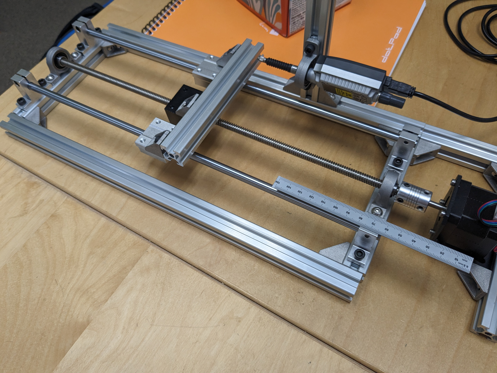

# Linear CNC Stage Control with Arduino and TMC2209

This project demonstrates how to control a linear CNC stage using an Arduino, a TMC2209 stepper motor driver, and a Mitutoyo LGS-1012P linear encoder. The system employs a PID control loop to accurately position the stage. Additionally, this project demonstrates how to make use of the Mitutoyo digimatic serial interface for reading precise linear position measurements.

## Components

- **Arduino (e.g., Arduino Uno, Mega)**
- **TMC2209 Stepper Motor Driver**
- **Stepper Motor**
- **Mitutoyo LGS-1012P Linear Encoder**
- **Power Supply (appropriate for your stepper motor)**
- **Connecting Wires**
- **Breadboard (optional for prototyping)**

## Wiring

### Arduino to TMC2209
- **ENABLE_PIN** (D2) -> TMC2209 EN
- **DIR_PIN** (D3) -> TMC2209 DIR
- **STEP_PIN** (D4) -> TMC2209 STEP
- **SW_TX** (D6) -> TMC2209 PDN_UART
- **SW_RX** (D7) -> TMC2209 PDN_UART
- **GND** -> TMC2209 GND
- **5V** -> TMC2209 VCC

### TMC2209 to Stepper Motor
- **A1** -> Stepper Motor Coil A1
- **A2** -> Stepper Motor Coil A2
- **B1** -> Stepper Motor Coil B1
- **B2** -> Stepper Motor Coil B2

### Arduino to Mitutoyo Linear Encoder
- **REQ_PIN** (D11) -> Encoder REQ
- **DATA_PIN** (D8) -> Encoder DATA
- **CK_PIN** (D9) -> Encoder CLK
- **GND** -> Encoder GND
- **5V** -> Encoder VCC

### Power Supply
- **Power Supply Positive (e.g., 12V)** -> TMC2209 VM
- **Power Supply Ground** -> TMC2209 GND

## Setup Image



## Arduino Code

The Arduino code for this project, which communicates over the `micro-ROS` agent, can be found in the file: [`/motor_linear_encoder_control/motor_linear_encoder_control.ino`](./motor_linear_encoder_control/motor_linear_encoder_control.ino). This code implements a PID control loop that reads the encoder value and adjusts the motor position to achieve the desired setpoint.

## Setting Up and Running the `micro-ROS` Agent with a Simulator

For this example, we will configure a ROS2 environment with the `micro-ROS` agent and use the `motor_controller` and `arduino_simulator_serial` packages to simulate a closed loop sequence.

Once these two are working together, we only need to modify the serial port which `micro-ROS` communicates over to target an actual Arduino Uno running the `.ino` sketch above.

### Installing `micro-ROS` Agent

First, you need to install the `micro-ROS` agent on your ROS2 machine.

### Running `micro-ROS` Agent

Use socat to create linked virtual serial ports on your computer:

```bash
sudo apt-get install socat
socat -d -d pty,raw,echo=0 pty,raw,echo=0
```

### Using `motor_controller` Package

The `motor_controller` package publishes `pos_cmd` values to the Arduino/simulator.

### Using the `arduino_simulator_serial` Package

This package simulates the Arduino behavior and communicates over a virtual serial port.

### Building 

Assuming this repository is near the home root of your environment (modify as necessary), we can build the packages using colcon.

```bash
cd ~/Arduino_Linear_Encoder_example
colcon build
```

### Running the Simulator Node

1. Ensure Virtual Serial Ports are Created using `socat`:

```bash
socat -d -d pty,raw,echo=0 pty,raw,echo=0
```

Note the virtual serial ports created, e.g. `/dev/pts/3` and `/dev/pts/4`.

2. Run `micro-ROS` Agent on `/dev/pts/3`:

```bash
ros2 run micro_ros_agent micro_ros_agent serial --dev /dev/pts/3
```

3. Run the Controller Node:

```bash
ros2 run motor_controller motor_controller_node
```

4. Run the Simulator Node on `dev/pts/4`:

```bash
ros2 run arduino_simulator_serial arduino_simulator_node /dev/pts/4
```

This setup allows you to simulate the Arduino `micro-ROS` behavior and communicate over a virtual serial bus using `socat`, making it look like a `micro-ROS` device. You can then test your ROS2 `motor_controller` package without needing the actual hardware.

When we do connect an Arduino Uno running the `micro-ROS` sketch, then we note the communication port, and we initialize the `micro-ROS` agent to interface with the hardware. As long as the Controller Node is running, then we should be able to use the `micro-ROS` agent to give setpoint commands to the Arduino Uno device in order to drive the motor and actuate the position of the linear stage.

## Usage

1. **Wiring**: Follow the wiring instructions provided above to connect your Arduino, TMC2209 driver, stepper motor, and Mitutoyo linear encoder.

2. **Upload Code**: Open the Arduino IDE, navigate to the provided Arduino code file (`/motor_linear_encoder_control/motor_linear_encoder_control.ino`), and upload it to your Arduino board.

3. **Monitor Output**: Open the Serial Monitor (set to 9600 baud rate) to observe the encoder readings and PID control output. Adjust the PID constants (`Kp`, `Ki`, `Kd`) as needed to achieve desired performance.

## License

This project is licensed under the MIT License. See the LICENSE file for details.
